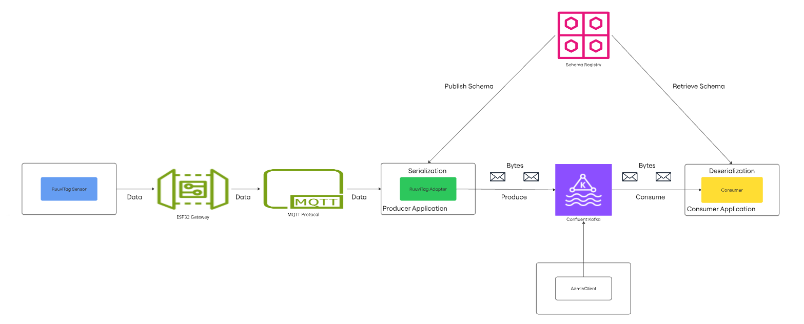

# IoT Data Ingestion Pipeline with Multi-Broker Kafka and Schema Registry
A scalable and fault-tolerant data pipeline for ingesting, processing, and analyzing real-time IoT data collected from RuuviTag sensors using ESP32 as gateway and MQTT as network protocol to connect ESP32 and Confluent Kafka (with multiple brokers in KRaft mode).

## Project Overview
This project implements a complete near real-time IoT data pipeline with the following components:

- Real-Time Data Collection: Collects real-time data with real IoT devices - specifically RuuviTags as BLE sensors and an ESP32 as a gateway and MQTT for network protocol
- Data Simulation: Simulates multiple IoT sensors (temperature, humidity, pressure, motion, light, etc.,) to generate data
- Data Ingestion: Uses Confluet-Kafka-Python for reliable, scalable data ingestion
- Data Processing: Processes and filters the data, generating alerts for anomalies
- Data Storage: Uses Apache-Iceberg for data storages
- Monitoring: Kafka UI for observability and operational insights

## Key Features
- High availability: Replication across multiple Kafka brokers
- Data Validation: Schema enforcement at produce time
- Fault Tolerance: Automatic failover and recovery
- Efficient Serialization: Compact binary format with Avro
- Anomaly Detection: Real-time monitoring for unusual sensor readings
- Horizontal Scaling: Add more brokers to handle increased load
- Schema Management: Centralized control of data formats

## Architecture


## Project Structure
```
metrocloud-data-pipeline/
├── README.md                               # Project Documentation
├── docker
│   ├── Dockerfile.consumer                 # Docker file for consumer service
│   ├── Dockerfile.producer                 # Docker file for producer service
│   ├── Dockerfile.ruuvitag_adapter         # Docker file for ruuvitag adapter service
│   └── docker-compose.yml                  # Docker Compose configuration for all services
├── esp32
│   └── ruuvitag_gateway
│       ├── CMakeLists.txt                  # Defines project name and target
│       ├── build
│       ├── main
│       │   ├── CMakeLists.txt              # IDF Component Register to declare dependencies
│       │   └── main.c
│       ├── partitions.csv                  # Tells ESP32 how to divide its internal flash memory into usable regions (partitions) for different purposes
│       ├── sdkconfig
├── images
│   ├── architecture.png
│   └── architecture1.png
│   └── architecture2.png
├── mqtt                                    # MQTT protocol configuration
│   └── config
│       └── mosquitto.conf
├── requirements.txt                        # Python dependencies
├── run_consumer.py                         # Standalone script for consumer in Docker
├── run_producer.py                         # Standalone script for producer in Docker
├── run_ruuvitag_adapter.py
└── src
    ├── __init__.py
    ├── __pycache__
    ├── config
    │   ├── __init__.py
    │   ├── __pycache__
    │   ├── config.py                       # Configuration using pydantic-settings and Schema Registry
    │   └── config.yaml
    ├── data_generator
    │   ├── __init__.py
    │   ├── __pycache__
    │   └── iot_simulator.py                # IoT device simulator (Avro-compatible)
    ├── data_ingestion
    │   ├── __init__.py
    │   ├── __pycache__
    │   ├── consumer.py                     # Kafka consumer implementation with Avro
    │   └── producer.py                     # Kafka producer implementation with Avro serialization
    ├── data_receiver
    │   ├── __init__.py
    │   └── ruuvitag_adapter.py
    ├── schemas
    │   └── iot_sensor_reading.avsc         # Avro schema for IoT sensor data
    └── utils
        ├── __init__.py
        ├── __pycache__
        ├── logger.py                       # Enhanced logger configuration
        └── schema_registry.py              # Schema Registry client implementation
```

## Technologies Used
- ESP-IDF (Expressif IoT Development Framework) and RuuviTag-Sensor
- Confluent Kafka: Message broker for data ingestion
- KRaft Mode: Kafka's Raft implementation (no ZooKeeper dependency)
- Confluent Python Client: For producing and consuming Kafka messags
- Pydantic: For configuration management and data validation
- Docker & Docker Compose: For containerization and orchestration
- Kafka UI: Web interface for monitoring Kafka
- Schema Registry: Centralized schema management for data validation and evolution
- Avro Serialization: Efficient binary format with embedded schema information

## Prerequisites
### Hardware
- RuuviTag sensors
- ESP32 development board with bluetooth and wireless compatibility
- Power supply for ESP32 (micro USB cable)
- Computer running Windows, Linux, or MacOS

### Software
- Toolchain to compile code for ESP32
- Build tools - CMake and Ninja to build a full application for ESP32
- ESP-IDF v4.4 or newer that essentially contains API (software libraries and source code) for ESP32 and scripts to operate the Toolchain
- Docker and Docker Compose
- Python 3.8+ (for local development)

## Getting Started
### Setup ESP-IDF Environment
If you haven't installed ESP-IDF yet, follow these steps:

#### Linux/MacOS
1. Clone ESP-IDF (ESP32 IoT Development Framework) repository

    Follow the [official ESP-IDF installation guide](https://docs.espressif.com/projects/esp-idf/en/stable/esp32/get-started/index.html) for your OS.

    ```bash
    mkdir -p ~/esp
    cd ~/esp
    git clone --recursive https://github.com/espressif/esp-idf.git
    cd ~/esp/esp-idf
    ./install.sh
    ```

2. Set environment variable to activate ESP-IDF (add this to .profile or .bashrc)
    ```bash
    . $HOME/esp/esp-idf/export.sh
    ```

#### Windows
1. Download the ESP-IDF Tools Installer from [official ESP-IDF installation guide](https://docs.espressif.com/projects/esp-idf/en/stable/esp32/get-started/index.html)
2. Follow the installer and follow the instructions
3. Open the ESP-IDF Command Prompt from the Start menu

### Compilation and Flashing
1. Configure the project
    
    ```bash
    idf.py set-target esp32
    idf.py menuconfig
    ```

    In the configuration menu:
    - Navigate to `Component config` -> `Bluetooth` -> `Bluetooth`
    - Enable `Bluetooth`
    - Enable `Bluedroid (the Bluetooth stack)`
    - Save the configuration and exit

2. Build the Project

    ```bash
    idf.py build
    ```

3. Flash the ESP32
    
    - Connect your ESP32 to the computer via USB
    - Determine the serial port (e.g., /dev/ttyUSB0 on Linux, COM3 on Windows)
    
    ```bash
    idf.py -p PORT flash
    ```
    Replace `PORT` with your ESP32's serial port.

4. Monitor the output

    ```bash
    idf.py -p PORT monitor
    ```
    Replace `PORT` with your ESP32's serial port.

### Running the Project with Docker Compose
1. Clone the repository:
    ```bash
    git clone <repository-url>
    cd <repository-name>
    ```

2. Start the Data collection service
    
    In the project's root directory
    ```bash
    cd esp32/ruuvitag_gateway
    
    idf.py build
    idf.py -p <PORT> flash
    idf.py -p <PORT> monitor
    ```
    This will perform the followings:
    - ESP32 collects the real-time IoT data from RuuviTag sensors via BLE
    - ESP32 sends the collected data to the Kafka via MQTT protocol

3. Configure MQTT Broker

    The MQTT broker is set up automatically in Docker, but you may need to:
    - Verify port 1883 is accessible for docker (If mosquitto broker service is active in local machine at port 1883, stop the service in the local machine)
    - Check MQTT broker logs in Docker
    - Test connectivity with MQTT clients

4. Start Docker Services:
    
    In the project's root directory,
    ```bash
    cd docker
    docker-compose up -d
    ```
    This will start:
    - 3 Kafka brokers in KRaft mode (each acting as both broker and controller)
    - Schema Registry for centralized schema management
    - Kafka UI for monitoring (accessible at http://localhost:8080)
    - Producer service that receives and sends IoT data with Avro serialization
    - Consumer service that processes the data with Avro deserialization

5. Verify System Operation
    ```bash
    # View all logs
    docker-compose logs -f

    # View logs for a specific service
    docker-compose logs -f mosquitto # check mqtt broker logs
    docker-compose logs -f ruuvitag-adapter # check RuuviTag adapter logs
    docker-compose logs -f kafka-broker-1 kafka-broker-2 kafka-broker-3 # check kafka broker logs
    docker-compose logs -f schema-registry # check schema registry logs
    docker-compose logs -f kafka-producer # check Kafka producer logs (for simulated IoT sensor data only, it is replaced by ruuvitag-adapter for real IoT data using RuuviTag sensors)
    docker-compose logs -f kafka-consumer # check Kafka consumer logs
    ```

6. Interact with Kafka using command-line tools
    ```bash
    # List Kafka topics
    docker exec -it kafka-broker-1 kafka-topics --bootstrap-server kafka:9092 --list

    # View messages on the topic
    docker exec -it kafka-broker-1 kafka-consumer --bootstrap-server kafka:9092 --topic iot-sensor-data --from-beginning
    ```

7. Access the Kafka UI
    - Open your browser and navigate to http://localhost:8080
    - This allows you to monitor:
        - Kafka broker health
        - Schema Registry to view registered schemas
        - Topics and messages
        - Consumer groups
        - Partitions and their replication status

9. Shutdown
    ```bash
    docker-compose down -v
    ```

10. Other services
    - Build individual image
    ```bash
    docker-compose build <image-name>
    ```
    - Restart the individual service
    ```bash
    docker-compose restart <service-name>
    ```
    - Check if any service started correctly
    ```bash
    docker-compose ps <service-name>
    ```

## Data Flow
The data flows through the system as follows:

1. RuuviTag -> ESP32
- RuuviTags broadcast BLE advertisements with sensor data
- ESP32 scans for advertisements and extracts sensor values
- ESP32 formats data into JSON

2. ESP32 -> MQTT -> RuuviTag Adapter
- ESP32 publishes JSON data to MQTT broker
- RuuviTag adapter subscribes to MQTT topic
- Adapter receives and validates data

3. RuuviTag Adapter -> Kafka
- Adapter transforms data to match Avro schema
- Adapter publishes to Kafka topic with proper serialization
- Schema Registry validates the data format

4. Kafka -> Consumer
- Consumer processes messages from Kafka
- Alerts generated for anomalous readings
- Data available for monitoring in Kafka UI

## Component Details
### RuuviTag Sensors:
RuuviTags are environmental BLE sensors that broadcast data including
- Temperature sensor (°C)
- Humidity sensor (%)
- Pressure sensor (Pa)
- Acceleration (g)
- Battery Voltage (V)
- Movement counter
- Transmission power (dBM)

### ESP32 Gateway
The ESP32 gateway:
- Scans for BLE advertisements from RuuviTags
- Decodes the data format (Format 5 supported)
- Connects to WiFi network
- Publishes data to MQTT broker
- Supports multiple RuuviTags simultaneously

### RuuviTag Adapter
- Subscribes to MQTT topic for incoming data
- Validates and transforms data to match Kafka schema
- Detects anomalies in readings
- Publishes to Kafka with proper Avro serialization
- Integrates smoothly with existing Kafka infrastructure

### Kafka Pipeline
The Kafka pipeline remains unchanged:
- Multi-broker setup for fault tolerance
- Schema Registry for data validation
- Topic partitioning for scalability
- Kafka UI for monitoring

### Kafka Cluster
#### Multi-Broker Setup
This project uses 3 Kafka brokers in a KRaft quorum:

| Broker | Internal Port | External Port |         Role        |
|--------|---------------|---------------|---------------------|
| kafka1 |      9092     |     29092     | broker + controller |
| Kafka2 |      9092     |     29093     | broker + controller |
| Kafka3 |      9092     |     29094     | broker + controller |

Benefits:
- High Availabliity: No single point of failure with data replicated across multiple brokers
- Scalability: Horizontal scaling by adding more brokers to handle increased load
- Fault Tolerance: System continues to operate even if one or more brokers fail
- Performance: Multiple brokers can handle more concurrent produceres and consumers

#### KRaft Mode (Kafka Raft)
This setup uses KRaft mode which eliminates the ZooKeeper dependency:
- All brokers participate in the Raft quorum
- Controllers quorum handles metadata management
- Each broker runs both controller and broker roles

#### Kafka Listeners
The Kafka configuration contains several listener configurations that are essential for proper network communication:

`KAFKA_LISTENERS`: 'PLAINTEXT://kafka1:9092,CONTROLLER://kafka1:29093,PLAINTEXT_HOST://0.0.0.0:29092'
`KAFKA_ADVERTISED_LISTENERS`: 'PLAINTEXT://kafka1:9092,PLAINTEXT_HOST://localhost:29092'
- `PLAINTEXT`: Used for internal communication between brokers and clients within Docker network
- `CONTROLLER`: Used for controller-to-controller communication in KRaft mode
- `PLAINTEXT_HOST`: Used for external access from the host machine

#### Controller Quorum
The KRaft controller quorum is configured with:

`KAFKA_CONTROLLER_QUORUM_VOTERS`: '1@kafka1:29093,2@kafka2:29093,3@kafka3:29093'

This defines the voting members of the Raft quorum, where each broker participates in the controller election process.

#### Kafka Topic
Topics are created with fault tolerance in mind:
- Replication Factor: 3 (data stored on all brokers)
- Partitions: 6 (allows parallel consumption)
- Min In-Sync Replicas: 2(requires at least 3 brokers to acknowledge writes) 

### Avro Schema and Schema Registry
#### Schema Registry
The Schema Registry provides:
- Centralized schema storage and versioninng
- Schema compatibility enforcement
- Schema evolution management
- Integration with Kafka producers and consumers

#### Avro Schema
The IoT sensor data schema (`iot_sensor_reading.avsc`) includes:
- Basic sensor information (device_id, device_type, timestamp)
- Measurement data (value, unit)
- Location information (latitude, longitude, building, floor, zone)
- Device status (battery_level, signal_strength, firmware_version)
- Anomaly detection (is_anomaly)
- Extensibility with metadata field

## Configuration Options
The application can be configured through environment variables:

### ESP32 Configuration Options
#### WiFI credentials
- `#define WIFI_SSID` "Your_WiFi_SSID"
- `#define WIFI_PASSWORD` "Your_WiFi_Password"

#### MQTT settings
- `#define MQTT_BROKER_URL` "mqtt://<Your_MQTT_Broker_IP>:1883"
- `#define MQTT_TOPIC` "ruuvitag/data"
- `#define MQTT_QOS` 1

#### Optional: RuuviTag settings
- `#define MAX_RUUVITAGS` 10 //Increase if you have more RuuviTags

### Docker Compose Configuration Options
#### Kafka Cluster Configuration
`Note:` `docker-compose.yml`

#### IoT Simulator Configuration
- `IOT_NUM_DEVICES`=8
- `IOT_DATA_INTERVAL_SEC`=1.0
- `IOT_DEVICE_TYPES`=temperature,humidity,pressure,motion,light
- `IOT_ANOMALY_PROBABILITY`=0.05

#### Schema Registry Configuration
`Note:` `docker-compose.yml`

#### Kafka UI Configuration
`Note:` `docker-compose.yml`

#### MQTT Broker Configuration
`Note:` `docker-compose.yml`

#### RuuviTag Adapter Configuration
`Note:` `docker-compose.yml`

#### Kafka Consumer
`Note:` `docker-compose.yml`

### Logging Configuration
- `LOG_LEVEL`=INFO

## Troubleshooting
### ESP32 Issues
1. Bluetooth Not Working
- Ensure Bluetooth is enabled in the ESP-IDF configuration
- Verify that the ESP32 module has Bluetooth capability and is properly initialized

2. ESP32 not connecting to WiFi
- Double-check the `SSID` and `password`
- Ensure the WiFi network is 2.4 GHz (ESP32 doesn't support 5 GHz)
- Check ESP32 serial monitor for connection errors

3. No RuuviTag Data
- Confirm RuuviTags are powered and broadcasting
- Place RuuviTags closer to the ESP32 during testing
- Check if the RuuviTags are using a supported data format (usually format 5)

4. Flash partition Issue

    When the compiled binary size exceeds the available space in the flash partition, it gives overflow error. To fix this issue,
    - Reduce the size of the binary
    - Increase the size of the partition

    Increasing the size of the partition is more straightforward. We'll need to create a custom partition table that increases the size of the factory partition. In ESP-IDF, partition table define how flash memory is allocated. It is configured by running the following commands:
    ```bash
    idf.py menuconfig
    ```
    In the menuconfig interface:
    - Navigate to `Partition Table` → `Partition Table`
    - Enable `Custom partition table CSV`
    - Save the configuration and exit

### MQTT Issues
1. ESP32 not connecting to MQTT broker in docker
- Verify the MQTT broker IP address is correct
- Ensure port 1883 is open (If mosquitto broker service is active in local machine at port 1883, stop the service in the local machine)
- Check that the MQTT broker in docker is running and accessible from the ESP32
- Ensure no firewall is blocking port 1883

2. No data in MQTT topic
- Check ESP32 logs for MQTT publish errors
- Verify topic name matches between ESP32 and adapter

### Kafka Issues
1. RuuviTag adapter not connecting to Kafka
- Check Kafka broker status
- Verify configuration parameters
- Look for connection errors in logs

2. Schema validation errors
- Verify the data format matches the schema
- Check Schema Registry status
- Review adapter transformation logic

3. Brokers Won't Start
- Check logs for configuration errors:
    ```bash
    docker-compose logs kafka1 kafka2 kafka3
    ```
4. Kafka Connection Issues
- Ensure all containers are on the same Docker network
- Check that Kafka brokers have had enough time to initialize before producers/consumers connect
- Verify the advertised listeners are configured correctly for both internal and external access

### Producer/Consumer Issues
- Check the logs for connection errors or exceptions
- Ensure the topic has been created
- Verify environment variables are set correctly

### Network Connectivity Issues
- Verify Docker network configuration:
    ```bash
    docker network inspect docker_kafka-net
    ```

## Maintenance and Monitoring
### RuuviTag Maintenance
- Check battery levels periodically
- Replace batteries when voltage drops below 2.5V
- Keep RuuviTags within range of ESP32

### ESP32 Maintenance
- Ensure stable power supply
- Monitor WiFi connectivity
- Update firmware as needed

### System Monitoring
- Use Kafka UI to monitor message flow
- Check logs for errors and anomalies
- Set up alerts for system issues

## Fault Tolerance Features
### Producer Resilience    
The producer is configured with:
- Connection to all brokers for automatic failover
- Retry mechanism with exponential backoff
- Delivery acknowledgement from all replicas (acks=all)
- Message batching for efficiency

### Consumer Resilience
The consumer is configured with:
- Connection to all brokers for automatic failover
- Cooperative rebalancing for smooth partition transitions
- Auto-commit of offsets for recovery
- Error handling and retry logic

## Monitoring
The Kafka UI provides insights into the health and performance of Kafka cluster:
- Broker status and configuration
- Topic information including partitions and replication
- Messages viewer with filtering capabilities
- Consumer group status and lag

## Advanced Operations
### Scaling the Cluster
To add a fourth broker to the cluster:
1. Add a new broker configuration to `docker-compose.yml`
2. Update the controller quorum voters list to include the new broker
3. Restart the cluster with `docker-compose up -d

### Monitoring Performance
One can monitor Kafka cluster performacne metrics using JMX and tools like Prometheus and Grafana.

### Data Recovery
The system is designed to automatically recover from most failure scenarios. In case of complete cluster failure:
1. Ensure all configuration files are intact
2. Start the cluster with `docker-compose up -d`
3. The brokers will recover data from the persistent volumes

## Next Steps and Enhancements
Further enhancements for this project:
1. Add data storage with ... 
2. Implement data processing with ...
3. Create visualization dashboards with ...
4. Implement machine learning for anomaly detection
5. Add authentication and TLS encryption for Kafka