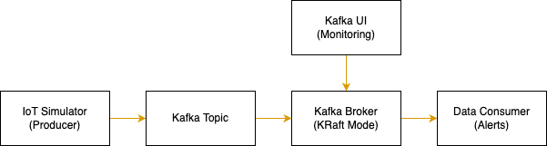

# IoT Data Ingestion Pipeline with Kafka
A scalable, fault-tolerant data pipeline for ingesting, processing, and analyzing IoT sensor data using Apache Kafka with multiple brokers in KRaft mode.

## Project Overview
This project implements a complete data ingestion pipeline for IoT devices with the following components:

- Data Simulation: Simulates multiple IoT sensors (temperature, humidity, pressure, motion, light) generating data
- Data Ingestion: Uses Apache Kafka for reliable, scalable data ingestion
- Data Processing: Processes and filters the data, generating alerts for anomalies
- Monitoring: Kafka UI for monitoring the Kafka cluster and topics

## Architecture


## Project Structure
```
metrocloud-data-pipeline/
├── docker/
│   ├── docker-compose.yml           # Docker Compose configuration for all services
│   ├── Dockerfile.producer          # Dockerfile for the producer service
│   └── Dockerfile.consumer          # Dockerfile for the consumer service
├── src/
│   ├── config/
│   │   ├── __init__.py
│   │   └── config.py                # Configuration using pydantic-settings
│   ├── data_generator/
│   │   ├── __init__.py
│   │   └── iot_simulator.py         # IoT device simulator
│   ├── data_ingestion/
│   │   ├── __init__.py
│   │   ├── producer.py              # Kafka producer implementation
│   │   └── consumer.py              # Kafka consumer implementation
│   └── utils/
│       ├── __init__.py
│       └── logger.py                # Logger configuration
├── main.py                          # Main application for local development
├── README.md                        # Project documentation
├── run_producer.py                  # Standalone script for producer in Docker
├── run_consumer.py                  # Standalone script for consumer in Docker
├── requirements.txt                 # Python dependencies
```

## Technologies Used
- Apache Kafka: Message broker for data ingestion
- KRaft Mode: Kafka's Raft implementation (no ZooKeeper dependency)
- Confluent Python Client: For producing and consuming Kafka messags
- Pydantic: For configuration management and data validation
- Docker & Docker Compose: For containerization and orchestration
- Kafka UI: Web interface for monitoring Kafka

## Getting Started
### Prerequisites
- Docker and Docker Compose
- Python 3.8+ (for local development)

### Running the Project with Docker Compose
1. Clone the repository:
    ```bash
    git clone <repository-url>
    cd <repository-name>
    ```

2. Start all services using Docker Compose:
    ```bash
    cd docker
    docker-compose up -d
    ```
    This will start:
    - 3 Kafka brokers in KRaft mode (each acting as both broker and controller)
    - Kafka UI for monitoring (accessible at http://localhost:8080)
    - Producer service that generates and sends IoT data
    - Consumer service that processes the data and generates alerts

3. View the logs
    ```bash
    # View all logs
    docker-compose logs -f

    # View logs for a specific service
    docker-compose logs -f kafka1 kafka2 kafka3
    docker-compose logs -f kafka-producer
    docker-compose logs -f kafka-consumer
    ```

4. Interact with Kafka using command-line tools
    ```bash
    # List Kafka topics
    docker exec kafka-broker kafka-topics --bootstrap-server kafka:9092 --list

    # View messages on the topic
    docker exec kafka-broker kafka-console-consumer --bootstrap-server kafka:9092 --topic iot-sensor-data --from-beginning
    ```

5. Access the Kafka UI:
    - Open your browser and navigate to http://localhost:8080
    - This allows you to monitor:
        - Kafka broker health
        - Topics and messages
        - Consumer groups
        - Partitions and their replication status

6. Shutdown
    ```bash
    docker-compose down -v
    ```

### Running Locally for Development
For development purposes, you can run the components separately:
1. Start only the Kafka broker and UI:
    ```bash
    cd docker
    docker-compose up -d kafka kafka-ui
    ```

2. Create a virtual python environment
    ```bash
    python -m venv venv
    source venv/bin/activate
    ```

3. Install Python dependencies
    ```bash
    pip install -r requirements.txt
    ```

3. Run the main application
    ```bash
    python main.py
    ```

## IoT Data Simulation
The system simulates the following types of IoT devices:
- Temperature sensors (°C)
- Humidity sensors (%)
- Pressure sensors (hPa)
- Motion sensors (boolean)
- Light sensors (lux)

Data generation includes occasional anomalies to test alert detection:

- Extreme temperature readings
- High humidity
- Low pressure
- Motion detection events
- Low light conditions

## Kafka Cluster Configuration
### Multi-Broker Setup
This project uses 3 Kafka brokers in a KRaft quorum:

| Broker | Internal Port | External Port |         Role        |
|--------|---------------|---------------|---------------------|
| kafka1 |      9092     |     29092     | broker + controller |
| Kafka2 |      9092     |     29093     | broker + controller |
| Kafka3 |      9092     |     29094     | broker + controller |

### KRaft Mode (Kafka Raft)
This setup uses KRaft mode which eliminates the ZooKeeper dependency:
- All brokers participate in the Raft quorum
- Controllers quorum handles metadata management
- Each broker runs both controller and broker roles

### Topic Configuration
Topics are created with fault tolerance in mind:
- Replication Factor: 3 (data stored on all brokers)
- Partitions: 6 (allows parallel consumption)
- Min In-Sync Replicas: 2(requires at least 3 brokers to acknowledge writes)

## Configuration Options
The application can be configured through environment variables:

### Kafka Configuration
- `KAFKA_BOOTSTRAP_SERVERS`: Comma-separated list of Kafka broker addresses
- `KAFKA_TOPIC_NAME`: Kafka topic name (default: "iot-sensor-data")
- `KAFKA_CONSUMER_GROUP_ID`: Consumer group ID (default: "iot-data-consumer")
- `KAFKA_AUTO_OFFSET_RESET`: Auto offset reset (default: "earliest")
- `KAFKA_REPLICATION_FACTOR`: Replication factor for topics (default: 3)
- `KAFKA_PARTITIONS`: Number of partitions per topic (default: 6)

### IoT Simulator Configuration
- `IOT_NUM_DEVICES`: Number of simulated IoT devices (default: 8)
- `IOT_DATA_INTERVAL_SEC`: Interval between data generation in seconds (default: 1.0)
- `IOT_DEVICE_TYPES`: Comma-separated list of device types to simulate
- `IOT_ANOMALY_PROBABILITY`: Probability of generating anomalous readings (default: 0.05)

### Logging Configuration
- `LOG_LEVEL`: Logging level (default: INFO)
- `ENVIRONMENT`: Set to "production" to enable file logging

## Understanding the Multi-Broker Setup
### Kafka Listeners Configuration
The Kafka configuration contains several listener configurations that are essential for proper network communication:

`KAFKA_LISTENERS`: 'PLAINTEXT://kafka1:9092,CONTROLLER://kafka1:29093,PLAINTEXT_HOST://0.0.0.0:29092'
`KAFKA_ADVERTISED_LISTENERS`: 'PLAINTEXT://kafka1:9092,PLAINTEXT_HOST://localhost:29092'

- `PLAINTEXT`: Used for internal communication between brokers and clients within Docker network
- `CONTROLLER`: Used for controller-to-controller communication in KRaft mode
- `PLAINTEXT_HOST`: Used for external access from the host machine

### Controller Quorum
The KRaft controller quorum is configured with:

`KAFKA_CONTROLLER_QUORUM_VOTERS`: '1@kafka1:29093,2@kafka2:29093,3@kafka3:29093'

This defines the voting members of the Raft quorum, where each broker participates in the controller election process.

## Multi-Broker Kafka Benefits
- High Availabliity: No single point of failure with data replicated across multiple brokers
- Scalability: Horizontal scaling by adding more brokers to handle increased load
- Fault Tolerance: System continues to operate even if one or more brokers fail
- Performance: Multiple brokers can handle more concurrent produceres and consumers 

## Fault Tolerance Features
### Producer Resilience    
The producer is configured with:
- Connection to all brokers for automatic failover
- Retry mechanism with exponential backoff
- Delivery acknowledgement from all replicas (acks=all)
- Message batching for efficiency

### Consumer Resilience
The consumer is configured with:
- Connection to all brokers for automatic failover
- Cooperative rebalancing for smooth partition transitions
- Auto-commit of offsets for recovery
- Error handling and retry logic

## Monitoring
The Kafka UI provides insights into the health and performance of Kafka cluster:
- Broker status and configuration
- Topic information including partitions and replication
- Messages viewer with filtering capabilities
- Consumer group status and lag

## Advanced Operations
### Scaling the Cluster
To add a fourth broker to the cluster:
1. Add a new broker configuration to `docker-compose.yml`
2. Update the controller quorum voters list to include the new broker
3. Restart the cluster with `docker-compose up -d

### Monitoring Performance
One can monitor Kafka cluster performacne metrics using JMX and tools like Prometheus and Grafana.

### Data Recovery
The system is designed to automatically recover from most failure scenarios. In case of complete cluster failure:
1. Ensure all configuration files are intact
2. Start the cluster with `docker-compose up -d`
3. The brokers will recover data from the persistent volumes

## Troubleshooting
### Brokers Won't Start
- Check logs for configuration errors:
    ```bash
    docker-compose logs kafka1
    ```

### Kafka Connection Issues
- Ensure all containers are on the same Docker network
- Check that Kafka brokers have had enough time to initialize before producers/consumers connect
- Verify the advertised listeners are configured correctly for both internal and external access

### Producer/Consumer Issues
- Check the logs for connection errors or exceptions
- Ensure the topic has been created
- Verify environment variables are set correctly

### Network Connectivity Issues
- Verify Docker network configuration:
    ```bash
    docker network inspect docker_kafka-net
    ```

## Next Steps and Enhancements
Further enhancements for this project:
1. Add data storage with ... 
2. Implement data processing with ...
3. Create visualization dashboards with ...
4. Implement machine learning for anomaly detection
5. Add authentication and TLS encryption for Kafka
>>>>>>> origin/Rabindra
