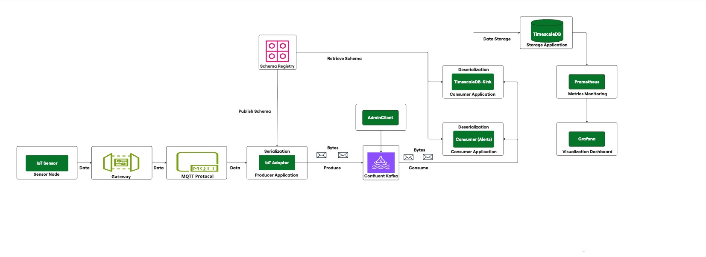

# IoT Data Ingestion Pipeline with Multi-Broker Kafka and Schema Registry

A scalable and fault-tolerant data pipeline that collects real-time IoT sensor data from RuuviTag sensors via ESP32 gateway, processes it through a multi-broker Kafka cluster with Schema Registry validation, stores it in TimescaleDB for time-series analytics, and provides comprehensive monitoring via Prometheus and Grafana.

## Project Overview

This project implements a complete near real-time IoT data pipeline with the following components:

- `Real-Time Data Collection`: Collects real-time data with real IoT devices - specifically RuuviTags as BLE sensors and an ESP32 as a gateway and MQTT for network protocol
- `Data Simulation`: Simulates multiple IoT sensors (temperature, humidity, pressure, motion, light, etc.,) to generate data
- `Data Ingestion`: Uses Confluet-Kafka-Python for reliable, scalable data ingestion
- `Data Processing`: Processes and filters the data, generating alerts for anomalies
- `Data Storage`: Uses TimescaleDB for time-series data storage with automatic archiving
- `Monitoring & Observability`: Comprehensive monitoring with Prometheus, Grafana, and AlertManager
- `Alerting`: Real-time alerts for systems and data anomalies

## Key Features

- `Real-time IoT Data Collection`: Physical RuuviTag sensors with ESP32 gateway
- `High availability`: Multi-broker Kafka cluster in KRaft mode (no ZooKeeper)
- `Schema Evolution`: Avro serialization with Schema Registry
- `Time-series Storage`: TimescaleDB with automatic compression and retention
- `Fault Tolerance`: Automatic failover and recovery
- `Containerized`: Complete Docker Compose deployment
- `Scalable`: Horizontal scaling support
- `Comprehensive Monitoring`: Prometheus metrics with Grafana dashboards
- `Alerting System`: Real-time alerts via AlertManager with email notifications
- `Data Analytics`: Query historical data and generate insights

## Architecture



## Project Structure

```
iot-data-pipeline/
├── .gitignore
├── database
│   └── init.sql                            # TimescaleDB database initialization script
├── docker
│   ├── docker-compose.yml                  # Docker Compose configuration for all services
│   ├── Dockerfile.consumer                 # Docker file for consumer service
│   ├── Dockerfile.timescaledb_sink
│   ├── Dockerfile.producer                 # Docker file for producer service
│   └──Dockerfile.ruuvitag_adapter          # Docker file for ruuvitag adapter service
├── esp32
│   └── ruuvitag_gateway
│       ├── CMakeLists.txt                  # Defines project name and target
│       ├── main
│       │   ├── CMakeLists.txt              # IDF Component Register to declare dependencies
│       │   └── main.c
│       ├── partitions.csv                  # Tells ESP32 how to divide its internal flash memory into usable regions (partitions) for different purposes
│       └── sdkconfig
├── images
│   ├── architecture.png
│   ├── architecture1.png
│   ├── architecture2.png
│   ├── architecture3.png
│   ├── architecture4.png
│   └── architecture5.png
├── monitoring                              # Monitoring configuration
│   ├── alertmanager                        
│   │   └── alertmanager.yml                # Alert routing configurations
│   ├── grafana
│   │   ├── dashboards
│   │   │   └── iot-pipeline.json           # IoT pipeline dashboard
│   │   └── provisioning
│   │       ├── datasources/
│   │       │   └── datasource.yml          # Prometheus datasource config
│   │       └── dashboards/
│   │           └── dashboard.yml           # Dashboard provisioning
│   ├── jmx                                 # JMX exporter configurations
│   │   ├── kafka1-jmx-config.yml
│   │   ├── kafka2-jmx-config.yml
│   │   └── kafka3-jmx-config.yml
│   └── prometheus                          # Prometheus configuration
│       ├── prometheus.yml
│       └── rules
│           └── alert_rules.yml              # Alerting rules
├── mqtt                                    # MQTT protocol configuration
│   └── config
│       └── mosquitto.conf
├── README.md                               # Project Documentation
├── requirements.txt                        # Python dependencies
├── run_consumer.py                         # Standalone script for consumer in Docker
├── run_timescaledb_sink.py                 # Standalone script for TimescaleDB sink
├── run_producer.py                         # Standalone script for producer in Docker
├── run_ruuvitag_adapter.py                 # Standalone script for RuuviTag adapter
└── src
    ├── __init__.py
    ├── __pycache__
    ├── config
    │   ├── __init__.py
    │   ├── __pycache__
    │   ├── config.py                       # Configuration using pydantic-settings and Schema Registry
    │   └── config.yaml
    ├── data_generator
    │   ├── __init__.py
    │   ├── __pycache__
    │   └── iot_simulator.py                # IoT device simulator (Avro-compatible)
    ├── data_ingestion
    │   ├── __init__.py
    │   ├── __pycache__
    │   ├── consumer.py                     # Kafka consumer implementation with Avro
    │   └── producer.py                     # Kafka producer implementation with Avro serialization
    ├── data_receiver
    │   ├── __init__.py
    │   └── ruuvitag_adapter.py
    ├── data_storage
    │   ├── __init__.py
    │   ├── database.py                     # TimescaleDB database connection and operations
    │   ├── models.py                       # Data models for sensor readings
    │   └── timescaledb_sink.py              # Kafka to TimescaleDB data sink
    ├── schemas
    │   └── iot_sensor_reading.avsc         # Avro schema for IoT sensor data
    └── utils
        ├── __init__.py
        ├── __pycache__
        ├── database_utils.py               # Database utility functions
        ├── logger.py                       # Enhanced logger configuration
        ├── metrics.py                      # Comprehensive Prometheus metrics integration
        └── schema_registry.py              # Schema Registry client implementation
```

## Technologies Used

- ESP-IDF (Expressif IoT Development Framework) and RuuviTag-Sensor
- Docker & Docker Compose: For containerization and orchestration
- Confluent Kafka: Message broker for data ingestion
- KRaft Mode: Kafka's Raft implementation (no ZooKeeper dependency)
- Confluent Python Client: For producing and consuming Kafka messags
- Kafka UI: Web interface for monitoring Kafka
- Schema Registry: Centralized schema management for data validation and evolution
- Avro Serialization: Efficient binary format with embedded schema information
- TimescaleDB: Relational database for time-series data storage
- SQLAlchemy: SQL toolkit and ORM for database operations
- Pydantic: For configuration management and data validation
- Prometheus + Grafana + AlertManager: For real-time IoT pipeline metrics monitoring, visualizations and dashboards

## Prerequisites

1. Hardware Requirements

    - RuuviTag sensors
    - ESP32 development board (with bluetooth and wireless compatibility)
    - Computer (Windows, Linux, or MacOS) for development and monitoring

2. Software Requirements

    - Toolchain to compile code for ESP32
    - Build tools - CMake and Ninja to build a full application for ESP32
    - ESP-IDF v4.4 or newer that essentially contains API (software libraries and source code) for ESP32 and scripts to operate the Toolchain
    - Docker and Docker Compose
    - Python 3.8+ (for local development)
    - Git for version control

3. Network Requirements

    - WiFi network (2.4GHz for ESP32)
    - Available ports: 1883(MQQT), 8080(Kafka UI), 8081(Schema Registry), 5432(TimescaleDB), 9090(Prometheus), 3000(Grafana), 9095(AlertManager), 8025(MailPit)

## Setup ESP-IDF Environment

If you haven't installed ESP-IDF yet, follow these steps:

1. Linux/MacOS

    - Clone ESP-IDF (ESP32 IoT Development Framework) repository

        Follow the [official ESP-IDF installation guide](https://docs.espressif.com/projects/esp-idf/en/stable/esp32/get-started/index.html) for your OS.

        ```bash
        mkdir -p ~/esp
        cd ~/esp
        git clone --recursive https://github.com/espressif/esp-idf.git
        cd ~/esp/esp-idf
        ./install.sh
        ```

    - Set environment variable to activate ESP-IDF (add this to .profile or .bashrc)
        ```bash
        . $HOME/esp/esp-idf/export.sh
        ```

2. Windows

    - Download the ESP-IDF Tools Installer from [official ESP-IDF installation guide](https://docs.espressif.com/projects/esp-idf/en/stable/esp32/get-started/index.html)
    - Follow the installer and follow the instructions
    - Open the ESP-IDF Command Prompt from the Start menu

## Quick Start with Docker Compose

1. Clone and Setup:

    - Clone the repository
        ```bash
        git clone <repository-url>
        cd <repository-name>
        ```

    - Create an environment variable in docker/.env file
        ```bash
        CLUSTER_ID=bdPLhBd7R2azWv-YLNO3LQ
        ```
        
        OR Generate the CLUSTER_ID using the following command
        ```bash
        docker run --rm confluentinc/cp-kafka:7.9.0 kafka-storage random-uuid
        ```

2. Configure ESP32 Gateway

    - Navigate to ESP32 project
        ```bash
        cd esp32/ruuvitag_gateway
        ```

    - Configure your WiFi and MQTT settigns in main/main.c
        ```bash
        vim main/main.c
        ```

    - Update:
        - WIFI_SSID and WIFI_PASSWORD
        - MQTT_BROKER_URL (Computer-IP-address)

    - Set ESP32 target and configure
        ```bash
        idf.py set-target esp32
        idf.py menuconfig
        ```

        In the configuration menu:
        - Navigate to `Component config` -> `Bluetooth` -> `Bluetooth`
        - Enable `Bluetooth`
        - Enable `Bluedroid (the Bluetooth stack)`
        - Save the configuration and exit

    - Build and flash
        ```bash
        idf.py build
        idf.py -p <PORT> flash # Replace <PORT> with your port
        idf.py -p <PORT> monitor # Replace <PORT> with your port
        ```
        This will perform the followings:
        - ESP32 collects the real-time IoT data from RuuviTag sensors via BLE
        - ESP32 sends the collected data to the Kafka via MQTT protocol

3. Configure MQTT Broker

    The MQTT broker is set up automatically in Docker, but you may need to:
    - Verify port 1883 is accessible for docker (If mosquitto broker service is active in local machine at port 1883, stop the service in the local machine)
    - Check MQTT broker logs in Docker
    - Test connectivity with MQTT clients

4. Start Docker Services:

    - In the root project,
        ```bash
        cd docker
        ```

    - Start all services
        ```bash
        docker-compose up -d
        ```
        This will start:
        - 3 Kafka brokers in KRaft mode (each acting as both broker and controller)
        - Schema Registry for centralized schema management
        - Kafka UI for monitoring (accessible at http://localhost:8080)
        - Producer service that receives and sends IoT data with Avro serialization
        - Consumer/Sink service that consumes and processes the data with Avro deserialization
        - Storage service that stores the time-series data into database

5. Verify System Operation
    ```bash
    # Check service status
    docker-compose ps

    # View all logs
    docker-compose logs -f

    # View logs for a specific service
    docker-compose logs -f mosquitto # check MQTT Broker logs
    docker-compose logs -f ruuvitag-adapter # check RuuviTag adaptr logs
    docker-compose logs -f kafka-broker-1 kafka-broker-2 kafka-broker-3 # check Kafka Broker logs
    docker-compose logs -f schema-registry # check Schema Registry logs
    docker-compose logs -f kafka-producer # check Kafka Producer logs (for simulated IoT sensor data only, it is replaced by ruuvitag-adapter for real IoT data using RuuviTag sensors)
    docker-compose logs -f kafka-consumer # check Kafka consumer logs
    docker-compose logs -f kafka-ui # Check Kafka UI logs
    docker-compose logs -f timescaledb # check Timescaledb logs
    docker-compose logs -f timescaledb-sink # check Timescaledb sink logs
    ```

6. Interact with Kafka using command-line tools
    ```bash
    # List Kafka topics
    docker exec -it kafka-broker-1 kafka-topics --bootstrap-server kafka-broker-1:9092 --list

    # View messages on the topic
    docker exec -it kafka-broker-1 kafka-console-consumer --bootstrap-server kafka-broker-1:9092 --topic iot-sensor-data --from-beginning
    ```

7. Access Timescaledb Database
    ```bash
    # Connect to TimescaleDB using psql cli
    docker exec -it timescaledb psql -U iot_user -d iot_data
    ```

    ```sql
    -- Inside psql, list databases
    iot_dat=# \l

    -- Switch database
    iot_data=# \c <database-name>

    -- List tables, views, sequence
    iot_data=# \d

    -- List only tables
    iot_data=# \dt

    -- List all hypertables
    iot_data=# select * from timescaledb_information.hypertables;

    -- List chunks of a specific hypertable
    iot_data=# SELECT * FROM timescaledb_information.chunks WHERE hypertable_name = '<hypertable-name>';

    -- Check compression statistics
    SELECT * FROM timescaledb_information.compression_settings;
    ```

8. Accessing Monitoring interfaces
    - Promethus: http://localhost:9090
    - Grafana: http://localhost:3000 (admin/admin123)
    - Kafka UI: http://localhost:8080
    - AlertManager: http://localhost:9095
    - Mailpit (Test SMTP): http://localhost:8025

9. Shutdown
    ```bash
    docker-compose down -v
    ```

11. Other services
    - Build individual image
    ```bash
    docker-compose build <image-name>
    ```
    - Restart the individual service
    ```bash
    docker-compose restart <service-name>
    ```
    - Check if any service started correctly
    ```bash
    docker-compose ps <service-name>
    ```

## Data Flow

The data flows through the system as follows:

1. Data Collection

    - RuuviTag -> ESP32 -> MQTT -> RuuviTag Adapter
        - RuuviTags broadcast BLE advertisements with sensor data
        - ESP32 scans for advertisements and extracts sensor values
        - ESP32 publishes JSON data to MQTT broker
        - RuuviTag adapter subscribes and validates data

2. Data Processing

    - RuuviTag Adapter -> Kafka -> Consumer/Sink

        - Adapter transforms data to match Avro schema
        - Schema Registry validates data format
        - Data published to partitioned Kafka topic
        - Multiple consumers process data in parallel

3. Data Storage

    - Kafka -> Timescaledb Sink -> TimescaleDB

        - Sink consumes messags with Avro deserialization
        - Batch insertion for optimal performance
        - Automatic compression and retention policies
        - Continuous aggregates for analytics

4. Monitoring

    -   All services -> Prometheus -> Grafana

        - Real-time metrics collection and storage
        - Historical data queries
        - Monitoring dashboards
        - Analytics and reporting

## Components

1. ESP32 Gateway
    
    The ESP32 gateway acts as bridge between BLE sensors and WiFi/MQTT that

    - scans for BLE advertisements from RuuviTags
    - decodes the data format (Format 5 supported)
    - connects to WiFi network
    - publishes data to MQTT broker
    - supports multiple RuuviTags simultaneously

2. RuuviTag Sensors
    
    RuuviTags are environmental BLE sensors that broadcast data including

    - Temperature sensor (°C)
    - Humidity sensor (%)
    - Pressure sensor (Pa)
    - Acceleration (g)
    - Battery Voltage (V)
    - Movement counter
    - Transmission power (dBM)

3. RuuviTag Adapter

    - Subscribes to MQTT topic for incoming data
    - Validates and transforms MQTT messages to Kafka records
    - Detects anomalies in readings
    - Publishes to Kafka with proper Avro serialization
    - Integrates smoothly with existing Kafka infrastructure

4. Kafka Pipeline

    The Kafka pipeline consists of:

    - Multi-broker setup for fault tolerance
    - Schema Registry for data validation
    - Topic partitioning for scalability
    - Kafka UI for monitoring

5.  Avro Schema and Schema Registry
    
    - Schema Registry

        The Schema Registry provides:

        - Centralized schema storage and versioninng
        - Schema compatibility enforcement
        - Schema evolution management
        - Integration with Kafka producers and consumers

    - Avro Schema

        The IoT sensor data schema (`iot_sensor_reading.avsc`) includes:

        - Basic sensor information (device_id, device_type, timestamp)
        - Measurement data (value, unit)
        - Location information (latitude, longitude, building, floor, zone)
        - Device status (battery_level, signal_strength, firmware_version)
        - Anomaly detection (is_anomaly)
        - Extensibility with metadata field

6. TimescaleDB Sink

    - Consumes IoT data from Kafka with Avro deserialization
    - Validates and transforms data for database storage
    - Performs batch insertions for optimal performance
    - Compression and continuous aggregates

7. TimescalDB Database

    - Stores sensor readings with full metadata
    - Supports geospatial data for device locations
    - Implements data archiving and retention policies
    - Provides views for common queries
    - Includes integrity constraints and indexes

8. Monitoring and Observability

    - Prometheus
    
        - `Scraping Intervals`: 15-30 seconds for most services
        - `Retention`: 15 days of metric data storage
        - `Alert Evaluation`: Every 15 seconds
        - `Service Discovery`: Static configuration for Docker services

    - Grafana Setup

        - `Data Sources`: Prometheus configured automatically
        - `Dashboard Provisioning`: IoT pipeline dashboard auto-loaded
        - `User Management`: Default admin user with configurable password
        - `Plugins`: Clock panel and JSON datasource included

    - JMX Monitoring

        - `Kafka Metrics`: Comprehensive broker, topic, and request metrics
        - `Custom Configurations`: Per-broker JMX exporter setup
        - `Performance Metrics`: Request latency, throughput, partition health  

9. Metrics Collection

    - Application Metrics

        - `Producer/Consumer`: Message throughput, processing latency, error rates
        - `TimescaleDB Sink`: Batch sizes, insert performance, database connections
        - `RuuviTag Adapter`: MQTT messages, data transformations, device counts
        - `Data Quality`: Anomaly detection rates, validation failures

    - Infrastructure Metrics

        - `Kafka`: Broker health, partition status, consumer lag
        - `TimescaleDB`: Connection pools, query performance, storage usage
        - `MQTT`: Client connections, message rates, broker status
        - `System`: CPU, memory, disk usage, network I/O

    - Custom Business Metrics

        - `IoT Devices`: Active device counts, sensor readings per minute
        - `Data Pipeline`: End-to-end latency, data quality scores
        - `Anomalies`: Detection rates by sensor type and threshold violations

## Configuration Options
The application can be configured through environment variables:

1. ESP32 Configuration Options
    - WiFI credentials
        - `#define WIFI_SSID` "Your_WiFi_SSID"
        - `#define WIFI_PASSWORD` "Your_WiFi_Password"

    - MQTT settings
        - `#define MQTT_BROKER_URL` "mqtt://<Your_MQTT_Broker_IP>:1883"
        - `#define MQTT_TOPIC` "ruuvitag/data"
        - `#define MQTT_QOS` 1

    - Optional: RuuviTag settings
        - `#define MAX_RUUVITAGS` 10 //Increase if you have more RuuviTags

2. Docker Compose Configuration Options
    - Kafka Cluster Configuration
    
        - Multi-Broker Setup

            This project uses 3 Kafka brokers in a KRaft mode:

            | Broker | Internal Port | External Port |         Role        |
            |--------|---------------|---------------|---------------------|
            | kafka1 |      9092     |     29092     | broker + controller |
            | Kafka2 |      9092     |     29093     | broker + controller |
            | Kafka3 |      9092     |     29094     | broker + controller |

            Benefits:
            - `High Availabliity` - No single point of failure with data replicated across multiple brokers
            -  `Scalability` - Horizontal scaling by adding more brokers to handle increased load
            - `Fault Tolerance` - System continues to operate even if one or more brokers fail
            - `Performance`x - Multiple brokers can handle more concurrent produceres and consumers

        - KRaft Mode (Kafka Raft)
            
            This setup uses KRaft mode which eliminates the ZooKeeper dependency:

            - All brokers participate in the Raft quorum
            - Controllers quorum handles metadata management
            - Each broker runs both controller and broker roles

        - Kafka Listeners
        
            The Kafka configuration contains several listener configurations that are essential for proper network communication:

            - `KAFKA_LISTENERS`: 'PLAINTEXT://kafka1:9092,CONTROLLER://kafka1:29093,PLAINTEXT_HOST://0.0.0.0:29092'
            - `KAFKA_ADVERTISED_LISTENERS`: 'PLAINTEXT://kafka1:9092,PLAINTEXT_HOST://localhost:29092'
            - `PLAINTEXT`: Used for internal communication between brokers and clients within Docker network
            - `CONTROLLER`: Used for controller-to-controller communication in KRaft mode
            - `PLAINTEXT_HOST`: Used for external access from the host machine

        - Controller Quorum
            
            The KRaft controller quorum is configured with:

            - `KAFKA_CONTROLLER_QUORUM_VOTERS`: '1@kafka1:29093,2@kafka2:29093,3@kafka3:29093'

            This defines the voting members of the Raft quorum, where each broker participates in the controller election process.

        - Kafka Topic
        
            Topics are created with fault tolerance in mind:

            - Replication Factor: 3 (data stored on all brokers)
            - Partitions: 6 (allows parallel consumption)
            - Min In-Sync Replicas: 2(requires at least 3 brokers to acknowledge writes)

    - IoT Simulator Configuration
        - `IOT_NUM_DEVICES`=8
        - `IOT_DATA_INTERVAL_SEC`=1.0
        - `IOT_DEVICE_TYPES`=temperature,humidity,pressure,motion,light
        - `IOT_ANOMALY_PROBABILITY`=0.05

    - Schema Registry Configuration
    
        `Check => docker/docker-compose.yml`

    - Kafka UI Configuration

        `Check=> docker/docker-compose.yml`

    - MQTT Broker Configuration

        `Check => docker/docker-compose.yml`

    - RuuviTag Adapter Configuration

        `Check => docker/docker-compose.yml`

    - Kafka Consumer

        `Check => docker/docker-compose.yml`

    - TimescaleDB Configuration
        - `POSTGRES_DB`=iot_data
        - `POSTGRES_USER`=iot_user
        - `POSTGRES_PASSWORD`=iot_password
    
    - TimescaleDB Sink Configuration
        - `DATA_SINK_BATCH_SIZE`=50
        - `DATA_SINK_COMMIT_INTERVAL`=5.0
        - `POSTGRES_BATCH_SIZE`=100
        - `POSTGRES_ARCHIVE_AFTER_DAYS`=30
        - `POSTGRES_RETENTION_DAYS`=90

    - Prometheus

        `Check => docker/docker-compose.yml`

    - Grafana
        - `GF_SECURITY_ADMIN_USER`=admin
        - `GF_SECURITY_ADMIN_PASSWORD`=admin123
            
3. Logging Configuration
    - `LOG_LEVEL`=INFO

4. Monitoring Configuration

    - Prometheus Metrics

        All services expose metrics on dedicated ports:
        
        | Service               | Port  | Endpoint  | Key Metrics                                       |
        |-----------------------|-------|-----------|---------------------------------------------------|
        | RuuviTag Adapter      | 8002  | /metrics  | MQTT messages, transformations, device counts     |
        | Kafka Consumer        | 8001  | /metrics  | Message processing, consumer lag, errors          |
        | TimescaleDB Sink      | 8003  | /metrics  | Database inserts, batch performance, connections  |
        | Kafka JMX (Broker 1)  | 9101  | /metrics  | Broker health, topic metrics, partition status    |
        | Kafka JMX (Broker 2)  | 9102  | /metrics  | Broker health, topic metrics, partition status    |
        | Kafka JMX (Broker 3)  | 9103  | /metrics  | Broker health, topic metrics, partition status    |
        | PostgreSQL Exporter   | 9187  | /metrics  | Database performance, connections, queries        |
        | MQTT Exporter         | 9234  | /metrics  | MQTT broker status, client connections            |
        | Node Exporter         | 9100  | /metrics  | System metrics (CPU, memory, disk)                |
        | cAdvisor              | 8090  | /metrics  | Container resource usage                          |

## Database Management

1. Database Schema

    The TimescaleDB database includes:

    - `sensor_readings`: Main table for current sensor data
    - `sensor_readings_archive`: Archive table for old data
    - `device_summary`: View showing device statistics
    - `recent_sensor_readings`: View for last 24 hours
    - `anomalous_sensor_readings`: View for anomalous readings

2. Data Retention
    - `Active Data`: Kept in main table for 30 days (configurable)
    - `Archived Data`: Moved to archive table, kept for 90 days (configurable)
    - `Cleanup`: Automatic cleanup runs periodically via the TimescaleDB sink

## Monitoring

1. Accessing Monitoring interfaces
    - Promethus: http://localhost:9090
    - Grafana: http://localhost:3000 (admin/admin123)
    - Kafka UI: http://localhost:8080
    - AlertManager: http://localhost:9095
    - Mailpit (Test SMTP): http://localhost:8025


2. Database Monitoring

    - Access Timescaledb Database
        ```bash
        # Connect to TimescaleDB using psql cli
        docker exec -it timescaledb psql -U iot_user -d iot_data
        ```
    
    - Basic Time-Series Analysis
        ```sql
        -- Recent sensor readings (last 24 hours)
        SELECT 
            device_id,
            device_type,
            value,
            unit,
            timestamp,
            is_anomaly
        FROM sensor_readings
        WHERE timestamp >= NOW() - INTERVAL '24 hours'
        ORDER BY timestamp DESC
        LIMIT 100;

        -- Time-series data for specific device
        SELECT 
            timestamp,
            value,
            unit,
            battery_level,
            is_anomaly
        FROM sensor_readings
        WHERE device_id = 'c6:8d:c6:26:39:a6_temperature'
            AND timestamp >= NOW() - INTERVAL '7 days'
        ORDER BY timestamp DESC;

        -- Data within specific time range
        SELECT device_id, device_type, AVG(value) as avg_value, MIN(value) as min_value,
            MAX(value) as max_value,
            COUNT(*) as reading_count
        FROM sensor_readings
        WHERE timestamp BETWEEN '2025-06-17' AND '2025-06-18'
            AND device_type = 'temperature_sensor'
        GROUP BY device_id, device_type
        ORDER BY avg_value DESC;
        ```

    - Time Bucketing Queries
        ```sql
        -- Hourly averages for the last week
        SELECT 
            time_bucket('1 hour', timestamp) AS hour_bucket,
            device_id,
            device_type,
            AVG(value) as avg_value,
            MIN(value) as min_value,
            MAX(value) as max_value,
            COUNT(*) as readings_count,
            COUNT(CASE WHEN is_anomaly THEN 1 END) as anomaly_count
        FROM sensor_readings
        WHERE timestamp >= NOW() - INTERVAL '7 days'
            AND device_type = 'temperature_sensor'
        GROUP BY hour_bucket, device_id, device_type
        ORDER BY hour_bucket DESC, device_id;

        -- Daily aggregation with multiple metrics
        SELECT 
            time_bucket('1 day', timestamp) AS day_bucket,
            device_type,
            COUNT(DISTINCT device_id) as unique_devices,
            AVG(value) as avg_value,
            STDDEV(value) as std_deviation,
            PERCENTILE_CONT(0.5) WITHIN GROUP (ORDER BY value) as median_value,
            PERCENTILE_CONT(0.95) WITHIN GROUP (ORDER BY value) as p95_value,
            COUNT(*) as total_readings,
            COUNT(CASE WHEN is_anomaly THEN 1 END) as anomaly_count,
            (COUNT(CASE WHEN is_anomaly THEN 1 END) * 100.0 / COUNT(*)) as anomaly_percentage
        FROM sensor_readings
        WHERE timestamp >= NOW() - INTERVAL '30 days'
        GROUP BY day_bucket, device_type
        ORDER BY day_bucket DESC, device_type;

        -- 15-minute intervals for real-time monitoring
        SELECT 
            time_bucket('15 minutes', timestamp) AS time_bucket,
            device_id,
            AVG(value) as avg_value,
            last(value, timestamp) as latest_value,
            last(battery_level, timestamp) as latest_battery,
            MAX(timestamp) as last_reading_time
        FROM sensor_readings
        WHERE timestamp >= NOW() - INTERVAL '4 hours'
            AND device_type IN ('temperature_sensor', 'humidity_sensor')
        GROUP BY time_bucket, device_id
        ORDER BY time_bucket DESC, device_id;
        ```

    - Advanced Time-Series Analytics
        ```sql
        -- Gap detection (missing data periods longer than 30 minutes)
        WITH time_series AS (
            SELECT 
                device_id,
                timestamp,
                LAG(timestamp) OVER (PARTITION BY device_id ORDER BY timestamp) as prev_timestamp,
                timestamp - LAG(timestamp) OVER (PARTITION BY device_id ORDER BY timestamp) as time_gap
            FROM sensor_readings
            WHERE device_id = 'c6:8d:c6:26:39:a6_temperature'
                AND timestamp >= NOW() - INTERVAL '7 days'
        )
        SELECT 
            device_id,
            prev_timestamp,
            timestamp,
            time_gap,
            EXTRACT(EPOCH FROM time_gap) / 60 as gap_minutes
        FROM time_series
        WHERE time_gap > INTERVAL '30 minutes'
        ORDER BY timestamp DESC;

        -- Moving averages and trends
        SELECT
            device_id,
            timestamp,
            value,
            AVG(value) OVER (
                PARTITION BY device_id 
                ORDER BY timestamp 
                ROWS BETWEEN 11 PRECEDING AND CURRENT ROW
            ) as moving_avg_12_readings,
            value - LAG(value, 1) OVER (
                PARTITION BY device_id 
                ORDER BY timestamp
            ) as value_change
        FROM sensor_readings
        WHERE device_type = 'temperature_sensor'
            AND timestamp >= NOW() - INTERVAL '24 hours'
        ORDER BY device_id, timestamp DESC;

        -- Rate of change detection
        SELECT 
            device_id,
            timestamp,
            value,
            LAG(value) OVER (PARTITION BY device_id ORDER BY timestamp) as prev_value,
            LAG(timestamp) OVER (PARTITION BY device_id ORDER BY timestamp) as prev_timestamp,
            (value - LAG(value) OVER (PARTITION BY device_id ORDER BY timestamp)) / 
            EXTRACT(EPOCH FROM (timestamp - LAG(timestamp) OVER (PARTITION BY device_id ORDER BY timestamp))) * 3600 
            as rate_per_hour
        FROM sensor_readings
        WHERE device_type = 'temperature_sensor'
            AND timestamp >= NOW() - INTERVAL '6 hours'
        ORDER BY device_id, timestamp DESC;
        ```

    - Query Continuous Aggregates
        ```sql
        -- Query hourly continous aggregates
        SELECT 
            bucket,
            device_id,
            device_type,
            reading_count,
            avg_value,
            min_value,
            max_value,
            anomaly_count,
            latest_battery_level
        FROM sensor_readings_hourly
        WHERE bucket >= NOW() - INTERVAL '7 days'
            AND device_type = 'temperature_sensor'
        ORDER BY bucket DESC, device_id;

        -- Query daily continuous aggregates
        SELECT 
            bucket,
            device_id,
            device_type,
            reading_count,
            avg_value,
            min_value,
            max_value,
            anomaly_count,
            first_battery_level,
            latest_battery_level,
            (latest_battery_level - first_battery_level) as battery_change
        FROM sensor_readings_daily
        WHERE bucket >= NOW() - INTERVAL '30 days'
        ORDER BY bucket DESC, avg_value DESC;

    - Check compression statistics
        ```sql
        SELECT * FROM timescaledb_information.compression_settings;

        -- Check hypertable info
        SELECT * FROM timescaledb_information.hypertables;

        -- View recent data
        SELECT * FROM recent_sensor_readings LIMIT 10;

        -- Check anomalies
        SELECT * FROM anomalous_sensor_readings;

        -- Device statistics
        SELECT * FROM device_summary;
        ```

3. Health Checks
    ```bash
    # Check service health
    docker-compose ps

    # Test MQTT connection
    docker exec -it mosquitto mosquitto_sub -t "ruuvitag/data"

    # Test Kafka connection
    docker exec -it kafka-broker-1 kafka-topics --bootstrap-server kafka1:9092 --list

    # Test TimescaleDB connection
    docker exec -it timescaledb pg_isready -U iot_user
    ```

4. Key Metrics

    - IoT Pipeline Metrics

        - Message Processing
            - iot_messages_received_total
            - iot_messages_processed_total
            - iot_messages_failed_total
            - iot_processing_duration_seconds

        - MQTT Adapter
            - mqtt_adapter_messages_received_total
            - mqtt_adapter_ruuvitag_devices_seen
            - mqtt_adapter_transformation_duration_seconds_count

    - Infrastructure Metrics

        - Kafka
            - kafka_server_brokertopicmetrics_messagesin_total
            - kafka_server_replica_manager_under_replicated_partitions
            - kafka_network_requests_total

        - Database
            - pg_stat_database_numbackends
            - pg_stat_database_xact_commit

        - System
            - node_cpu_seconds_total
            - node_memory_MemAvailable_bytes
            - container_memory_usage_bytes

## Maintenance and Operations

1. RuuviTag Maintenance

    - Check battery levels periodically
    - Replace batteries when voltage drops below 2.5V
    - Keep RuuviTags within range of ESP32

2. ESP32 Maintenance

    - Ensure stable power supply
    - Monitor WiFi connectivity
    - Update firmware as needed

3. Database Maintenance
    - Monitor disk space usage
    - Run periodic cleanup operations
    - Check data integrity regularly
    - Monitor query performance

4. Monitoring Maintenance
    
    - Prometheus Data Management
        - `Storage`: Metrics retained for 15 days by default
        - `Disk Usage`: Monitor prometheus_tsdb_storage_size_bytes
        - `Cleanup`: Automatic retention policy handles old data

    - Grafana Management
        - `Dashboard Updates`: Modify JSON files in monitoring/grafana/dashboards/
        - `User Management`: Additional users can be configured
        - `Plugin Management`: Install additional plugins as needed

    - Alert Management
        - `Rule Updates`: Modify alert_rules.yml and restart Prometheus
        - `Notification Channels`: Configure additional receivers in AlertManager
        - `Silence Management`: Use AlertManager UI to manage alert silences

## Fault Tolerance Features

1. Producer Resilience

    The producer is configured with:

    - Connection to all brokers for automatic failover
    - Retry mechanism with exponential backoff
    - Delivery acknowledgement from all replicas (acks=all)
    - Message batching for efficiency

2. Consumer Resilience

    The consumer is configured with:

    - Connection to all brokers for automatic failover
    - Cooperative rebalancing for smooth partition transitions
    - Auto-commit of offsets for recovery
    - Error handling and retry logic

3. Database Resilience

    The TimescaleDB sink provides:

    - Batch processing for optimal performance
    - Automatic retry on database connection failures
    - Data validation before insertion
    - Graceful error handling and logging

## Advanced Operations

1. Scaling the Cluster
    
    - Add more Kafka Brokers:
        - Add a new broker configuration to `docker-compose.yml`
        - Update the controller quorum voters list to include the new broker
        - Restart the cluster with `docker-compose up -d  

2. Performance Optimization

    - Metrics Collection
        - `Scrape Frequency`: Adjust based on system load
        - `Metric Retention`: Configure based on storage requirements
        - `Label Cardinality`: Monitor high-cardinality metrics

    - Dashboard Performance
        - `Query Optimization`: Use appropriate time ranges
        - `Panel Refresh`: Configure refresh intervals based on needs
        - `Data Source`: Optimize Prometheus queries

3. Data Recovery

    The system is designed to automatically recover from most failure scenarios. In case of complete cluster failure:

    - Ensure all configuration files are intact
    - Start the cluster with `docker-compose up -d`
    - The brokers will recover data from the persistent volumes
    - TimescaleDB data is preserved in persistent volumes

4. Optimize TimescaleDB
    ```sql
    -- Adjust chunk intervals for your data volume
    SELECT set_chunk_time_interval('sensor_readings', INTERVAL '6 hours');

    -- Enable compression
    ALTER TABLE sensor_readings SET (timescaledb.compress);

    -- Add retention policy
    SELECT add_retention_policy('sensor_readings', INTERVAL '30 days');
    ```

## Troubleshooting

1. ESP32 Issues

    - Bluetooth Not Working
        - Ensure Bluetooth is enabled in the ESP-IDF configuration
        - Verify that the ESP32 module has Bluetooth capability and is properly initialized

    - ESP32 not connecting to WiFi
        - Double-check the `SSID` and `password`
        - Ensure the WiFi network is 2.4 GHz (ESP32 doesn't support 5 GHz)
        - Check ESP32 serial monitor for connection errors

    - No RuuviTag Data
        - Confirm RuuviTags are powered and broadcasting
        - Place RuuviTags closer to the ESP32 during testing
        - Check if the RuuviTags are using a supported data format (usually format 5)

    - Flash partition Issue

        When the compiled binary size exceeds the available space in the flash partition, it gives overflow error. To fix this issue,
        - Reduce the size of the binary
        - Increase the size of the partition

        Increasing the size of the partition is more straightforward. We'll need to create a custom partition table that increases the
        size of the factory partition. In ESP-IDF, partition table define how flash memory is allocated. It is configured by running
        the following commands:
        ```bash
        idf.py menuconfig
        ```
        In the menuconfig interface:
        - Navigate to `Partition Table` → `Partition Table`
        - Enable `Custom partition table CSV`
        - Save the configuration and exit

2. MQTT Issues

    - ESP32 not connecting to MQTT broker in docker
        - Verify the MQTT broker IP address is correct
        - Ensure port 1883 is open (If mosquitto broker service is active in local machine at port 1883, stop the service in the local machine)
        - Check that the MQTT broker in docker is running and accessible from the ESP32
        - Ensure no firewall is blocking port 1883

    - No data in MQTT topic
        - Check ESP32 logs for MQTT publish errors
        - Verify topic name matches between ESP32 and adapter

3. Kafka Issues

    - RuuviTag adapter not connecting to Kafka
        - Check Kafka broker status
        - Verify configuration parameters
        - Look for connection errors in logs

    - Schema validation errors
        - Verify the data format matches the schema
        - Check Schema Registry status
        - Review adapter transformation logic

    - Brokers Won't Start
        - Check logs for configuration errors:
            ```bash
            docker-compose logs kafka1 kafka2 kafka3
            ```
    - Kafka Connection Issues
        - Ensure all containers are on the same Docker network
        - Check that Kafka brokers have had enough time to initialize before producers/consumers connect
        - Verify the advertised listeners are configured correctly for both internal and external access

4. TimescaleDB Issues

    - Database Connection Failures
        - Check TimescaleDB service status:
            ```bash
            docker-compose logs timescaledb
            ```
        - Verify database credentials
        - Ensure database initialization completed
        - Check network connectivity

    - TimescaleDB Sink Not Working
        - Check sink service logs:
            ```bash
            docker-compose logs timescaledb-sink
            ```
        - Verify Kafka connectivity from sink
        - Check database permissions
        - Monitor batch processing logs

    - SQLAlchemy 'metadata' Attribute Error
        - This has been fixed by renaming the column to `device_metadata`
        - If you have existing data, run the migration:
            ```bash
            docker exec -it timescaledb psql -U iot_user -d iot_data -f /docker-entrypoint-initdb.d/02-migrate.sql
            ```

5. Producer/Consumer Issues

    - Check the logs for connection errors or exceptions
    - Ensure the topic has been created
    - Verify environment variables are set correctly

6. Network Connectivity Issues

    - Verify Docker network configuration:
        ```bash
        docker network inspect docker_kafka-net
        ```

7. Performance Issues

    - High latency or lag
        - Increase Kafka patitions for better parallelism
        - Tune TimescaleDB batch sizes
        - Monitor resource usage: docker stats
        - Scale consumers horizontally
        - Check network bandwidth

    - Memory or disk issues
        - Implement data retention policies
        - Enable TimescaleDB compression
        - Monitor disk usage
        - Adjust batch sizes and intervals

8. Monitoring Issues
    
    - Prometheus Not Collecting Metrics

        - Check service endpoints: curl http://localhost:8002/metrics
        - Verify scrape configuration in prometheus.yml
        - Check Prometheus logs: docker-compose logs prometheus

    - Grafana Dashboard Issues

        - Verify Prometheus datasource connection
        - Check dashboard JSON configuration
        - Review Grafana logs: docker-compose logs grafana

    - Missing Metrics

        - Confirm service metrics exposition
        - Check network connectivity between services
        - Verify metrics server startup in application logs

    - AlertManager Not Sending Alerts

        - Check alert rule evaluation in Prometheus
        - Verify AlertManager configuration
        - Test SMTP configuration with Mailpit

    - Common Monitoring Problems

        - High Memory Usage: Monitor prometheus_tsdb_head_samples
        - Missing Data Points: Check scrape_duration vs scrape_interval
        - Dashboard Loading Slowly: Optimize query time ranges
        - Alerts Not Firing: Verify expression evaluation in Prometheus

## Acknowledgements

- [ruuvi](https://ruuvi.com/) for excellent environmental sensors
- [ESPRESSIF](https://www.espressif.com/en/products/sdks/esp-idf) for ESP32 platform
- [mosquitto](https://mosquitto.org/) for MQTT protocol
- [CONFLUENT](https://developer.confluent.io/get-started/python/?session_ref=https://www.google.com/&_ga=2.115239876.2102348729.1750172126-1532447712.1744219053&_gac=1.53093082.1750172135.CjwKCAjwpMTCBhA-EiwA_-Msmf0YzSRvWOlxo3ylbokBzvAEdAKmGOT3O0G3KSnjOuc-PU-My69LtRoCQWIQAvD_BwE&_gl=1*i8p1b3*_gcl_aw*R0NMLjE3NTAxNzIxMzUuQ2p3S0NBandwTVRDQmhBLUVpd0FfLU1zbWYwWXpTUnZXT2x4bzN5bGJva0J6dkFFZEFLbUdPVDNPMEczS1Nuak91Yy1QVS1NeTY5THRSb0NRV0lRQXZEX0J3RQ..*_gcl_au*Mjg2MDE2MDg2LjE3NDQyMTkwNTM.*_ga*MTUzMjQ0NzcxMi4xNzQ0MjE5MDUz*_ga_D2D3EGKSGD*czE3NTAxNzIxMjYkbzQyJGcxJHQxNzUwMTcyMTg5JGo2MCRsMCRoMA..) for reliable messaging
- [timescaledb](https://github.com/timescale/timescaledb) for time-series database
- [CONFLUENT](https://docs.confluent.io/platform/current/schema-registry/index.html) for Schema Registry
- [Prometheus](https://prometheus.io/docs/introduction/overview/) for Prometheus metrics collection
- [Grafana](https://grafana.com/docs/grafana/latest/?pg=oss-graf&plcmt=hero-btn-2) for Grafana

## Next Steps and Enhancements

Further enhancements for this project:

- `Data Processing`: Implement stream processing with Kafka Streams or Apache Flink
- `Machine Learning`: Add anomaly detection and predictive analytics
- `API Layer`: Create REST API for data access and device management
- `Security`: Add authentication and TLS encryption for Kafka and TimescaleDB
- `Data Warehouse`: Add data warehouse integration for long-term analytics
- `Mobile App`: Create mobile application for real-time monitoring

